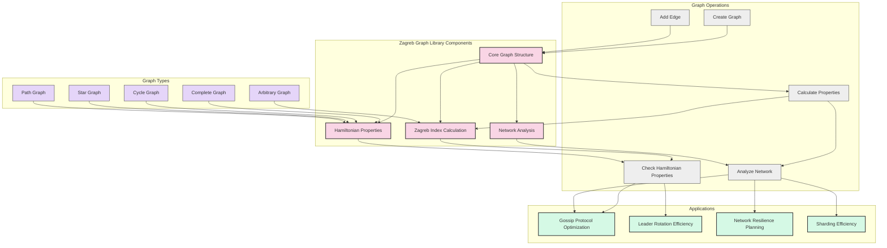

```mermaid
flowchart TB
    subgraph "Zagreb Graph Library Components"
        Core["Core Graph Structure"]
        Zagreb["Zagreb Index Calculation"]
        Hamilton["Hamiltonian Properties"]
        Analysis["Network Analysis"]
    end

    subgraph "Graph Operations"
        Create["Create Graph"]
        AddEdge["Add Edge"]
        Calculate["Calculate Properties"]
        CheckHamiltonian["Check Hamiltonian Properties"]
        NetworkAnalyze["Analyze Network"]
    end

    subgraph "Graph Types"
        Complete["Complete Graph"]
        Cycle["Cycle Graph"]
        Star["Star Graph"]
        Path["Path Graph"]
        Arbitrary["Arbitrary Graph"]
    end

    subgraph "Applications"
        GossipOpt["Gossip Protocol Optimization"]
        LeaderRotation["Leader Rotation Efficiency"]
        Resilience["Network Resilience Planning"]
        Sharding["Sharding Efficiency"]
    end

    %% Core library structure
    Core --> Zagreb
    Core --> Hamilton
    Core --> Analysis

    %% Operations
    Create --> Core
    AddEdge --> Core
    Core --> Calculate
    Calculate --> Zagreb
    Zagreb --> CheckHamiltonian
    Hamilton --> CheckHamiltonian
    Calculate --> NetworkAnalyze
    Analysis --> NetworkAnalyze

    %% Graph types influence analysis
    Complete --> Hamilton
    Cycle --> Hamilton
    Star --> Hamilton
    Path --> Hamilton
    Arbitrary --> Zagreb

    %% Applications of the library
    CheckHamiltonian --> GossipOpt
    NetworkAnalyze --> GossipOpt
    CheckHamiltonian --> LeaderRotation
    NetworkAnalyze --> Resilience
    NetworkAnalyze --> Sharding

    classDef core fill:#f9d5e5,stroke:#333,stroke-width:2px
    classDef operations fill:#eeeeee,stroke:#333,stroke-width:1px
    classDef applications fill:#d5f9e5,stroke:#333,stroke-width:2px
    classDef graphTypes fill:#e5d5f9,stroke:#333,stroke-width:1px

    class Core,Zagreb,Hamilton,Analysis core
    class Create,AddEdge,Calculate,CheckHamiltonian,NetworkAnalyze operations
    class Complete,Cycle,Star,Path,Arbitrary graphTypes
    class GossipOpt,LeaderRotation,Resilience,Sharding applications
```