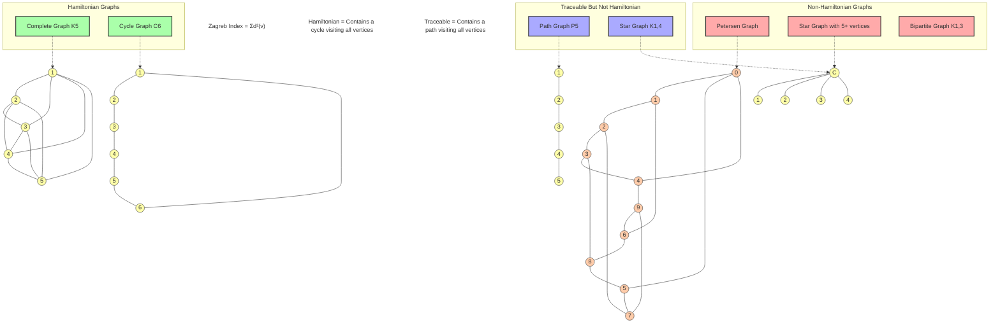

```mermaid
graph TD
    subgraph "Hamiltonian Graphs"
        HCP["Complete Graph K5"]
        HCY["Cycle Graph C6"]
    end
    
    subgraph "Non-Hamiltonian Graphs"
        HPT["Petersen Graph"]
        NHS["Star Graph with 5+ vertices"]
        NHB["Bipartite Graph K1,3"]
    end

    subgraph "Traceable But Not Hamiltonian"
        TP["Path Graph P5"]
        TS["Star Graph K1,4"]
    end

    %% Vertices for Complete Graph K5
    K5_1((1))
    K5_2((2))
    K5_3((3))
    K5_4((4))
    K5_5((5))
    
    %% Edges for Complete Graph K5
    K5_1 --- K5_2
    K5_1 --- K5_3
    K5_1 --- K5_4
    K5_1 --- K5_5
    K5_2 --- K5_3
    K5_2 --- K5_4
    K5_2 --- K5_5
    K5_3 --- K5_4
    K5_3 --- K5_5
    K5_4 --- K5_5
    
    %% Vertices for Cycle Graph C6
    C6_1((1))
    C6_2((2))
    C6_3((3))
    C6_4((4))
    C6_5((5))
    C6_6((6))
    
    %% Edges for Cycle Graph C6
    C6_1 --- C6_2
    C6_2 --- C6_3
    C6_3 --- C6_4
    C6_4 --- C6_5
    C6_5 --- C6_6
    C6_6 --- C6_1
    
    %% Petersen Graph
    P_0((0))
    P_1((1))
    P_2((2))
    P_3((3))
    P_4((4))
    P_5((5))
    P_6((6))
    P_7((7))
    P_8((8))
    P_9((9))
    
    %% Petersen Graph Outer Cycle
    P_0 --- P_1
    P_1 --- P_2
    P_2 --- P_3
    P_3 --- P_4
    P_4 --- P_0
    
    %% Petersen Graph Spokes
    P_0 --- P_5
    P_1 --- P_6
    P_2 --- P_7
    P_3 --- P_8
    P_4 --- P_9
    
    %% Petersen Graph Inner Pentagram
    P_5 --- P_7
    P_7 --- P_9
    P_9 --- P_6
    P_6 --- P_8
    P_8 --- P_5
    
    %% Vertices for Star Graph K1,4
    S_center((C))
    S_1((1))
    S_2((2))
    S_3((3))
    S_4((4))
    
    %% Edges for Star Graph K1,4
    S_center --- S_1
    S_center --- S_2
    S_center --- S_3
    S_center --- S_4
    
    %% Vertices for Path Graph P5
    Path_1((1))
    Path_2((2))
    Path_3((3))
    Path_4((4))
    Path_5((5))
    
    %% Edges for Path Graph P5
    Path_1 --- Path_2
    Path_2 --- Path_3
    Path_3 --- Path_4
    Path_4 --- Path_5
    
    %% Link description nodes to examples
    HCP -.-> K5_1
    HCY -.-> C6_1
    HPT -.-> P_0
    NHS -.-> S_center
    TP -.-> Path_1
    TS -.-> S_center
    
    %% Labels describing properties
    HC["Zagreb Index = Σd²(v)"]
    HT["Hamiltonian = Contains a cycle visiting all vertices"]
    TRA["Traceable = Contains a path visiting all vertices"]
    
    classDef hamiltonian fill:#aaffaa,stroke:#333,stroke-width:2px
    classDef nonhamiltonian fill:#ffaaaa,stroke:#333,stroke-width:2px
    classDef traceable fill:#aaaaff,stroke:#333,stroke-width:2px
    classDef vertex fill:#ffffaa,stroke:#333,stroke-width:1px
    classDef petersen fill:#ffccaa,stroke:#333,stroke-width:1px
    classDef label fill:white,stroke:none
    
    class HCP,HCY hamiltonian
    class HPT,NHS,NHB nonhamiltonian
    class TP,TS traceable
    class K5_1,K5_2,K5_3,K5_4,K5_5,C6_1,C6_2,C6_3,C6_4,C6_5,C6_6,S_center,S_1,S_2,S_3,S_4,Path_1,Path_2,Path_3,Path_4,Path_5 vertex
    class P_0,P_1,P_2,P_3,P_4,P_5,P_6,P_7,P_8,P_9 petersen
    class HC,HT,TRA label
```