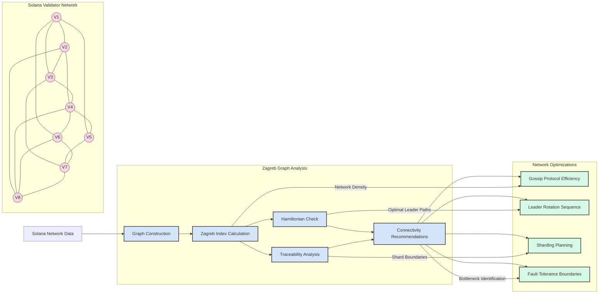

```mermaid
flowchart LR
    subgraph "Solana Validator Network"
        V1((V1))
        V2((V2))
        V3((V3))
        V4((V4))
        V5((V5))
        V6((V6))
        V7((V7))
        V8((V8))
    end
    
    subgraph "Zagreb Graph Analysis"
        GC["Graph Construction"]
        ZI["Zagreb Index Calculation"]
        HC["Hamiltonian Check"]
        TA["Traceability Analysis"]
        CR["Connectivity Recommendations"]
    end
    
    subgraph "Network Optimizations"
        GO["Gossip Protocol Efficiency"]
        LR["Leader Rotation Sequence"]
        SP["Sharding Planning"]
        FB["Fault-Tolerance Boundaries"]
    end
    
    %% Validator network connections
    V1 --- V2
    V1 --- V3
    V1 --- V5
    V1 --- V6
    V2 --- V3
    V2 --- V4
    V2 --- V8
    V3 --- V4
    V3 --- V7
    V4 --- V5
    V4 --- V6
    V4 --- V8
    V5 --- V7
    V6 --- V7
    V6 --- V8
    V7 --- V8
    
    %% Analysis Flow
    Solana["Solana Network Data"] --> GC
    GC --> ZI
    ZI --> HC
    ZI --> TA
    HC --> CR
    TA --> CR
    
    %% Optimization Applications
    CR --> GO
    CR --> LR
    CR --> SP
    CR --> FB
    
    %% Specific metrics derived
    ZI --> |"Network Density"| GO
    HC --> |"Optimal Leader Paths"| LR
    TA --> |"Shard Boundaries"| SP
    CR --> |"Bottleneck Identification"| FB
    
    classDef validator fill:#f9d5e5,stroke:#333,stroke-width:1px
    classDef analysis fill:#d5e5f9,stroke:#333,stroke-width:2px
    classDef optimization fill:#d5f9e5,stroke:#333,stroke-width:2px
    
    class V1,V2,V3,V4,V5,V6,V7,V8 validator
    class GC,ZI,HC,TA,CR analysis
    class GO,LR,SP,FB optimization
```